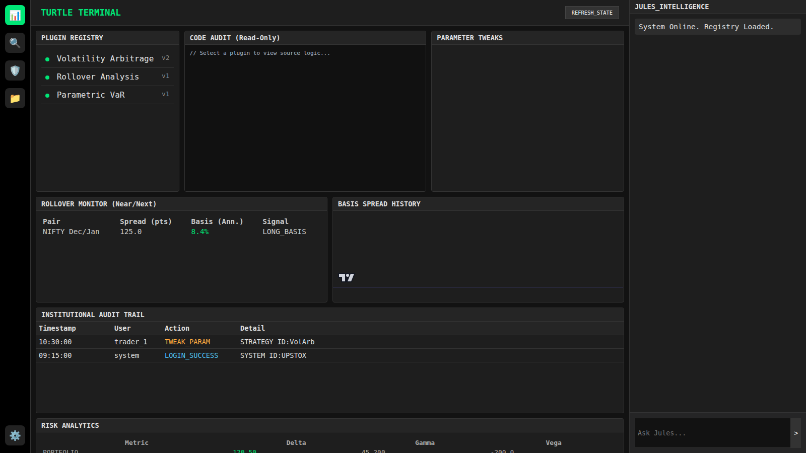

# Turtle Terminal: Product Overview

## 1. Executive Summary
**Turtle Terminal** is a local-first, institutional-grade derivatives analysis system designed for "White Box" transparency and risk management. It combines deterministic Python engines with AI-driven orchestration to provide decision support, not auto-trading. The system features a "Disconnected Intelligence" architecture where the AI reasoning layer never touches raw data directly.

## 2. Key Features

### 🏛️ Institutional Plugins
The system uses a hot-reloadable **Plugin Architecture** (`backend/plugins/`) to support custom strategies and risk models:
- **Strategies**:
  - `VolatilityArbitrage`: Exploits IV-RV divergence.
  - `PairsTrading`: Cointegration-based mean reversion.
  - `RolloverAnalysis`: Institutional basis spread monitoring (Cash & Carry).
- **Risk Models**:
  - `ParametricVaR`: Standard Variance-Covariance Value at Risk.
  - `ExpectedShortfall`: Tail risk assessment (CVaR).

### 🔍 "White Box" Audit Trail
Every interaction is logged to ensure compliance and reproducibility:
- **Parameter Tweaks**: Logs "Before" vs "After" state of strategy configs.
- **Code Changes**: Tracks source code diffs for all custom plugins.
- **Auth Events**: Logs login and token refresh actions.

### 🛡️ Risk Analytics Center
- **Real-Time Greeks**: Delta, Gamma, Vega, Theta aggregation across the portfolio.
- **Scenario Analysis**: Stress testing for Price Shocks and Volatility expansion.
- **Rollover Monitor**: Real-time Basis Spread and Arbitrage signal detection.

### 🔐 Secure & Local
- **TOTP Authentication**: Integrated with Upstox via `pyotp`.
- **Local Deployment**: Runs on WSL2 with Dockerized Database and Redis.
- **Disconnected AI**: LLMs generate code/logic but do not access client PII/Data.

## 3. User Interface (Dashboard)

The **Turtle Terminal Shell** (`http://localhost:8000/dashboard`) is a unified workspace:



### Panels:
1.  **Plugin Registry**: Toggle strategies On/Off and view version status.
2.  **Code Audit**: Read-only view of the active Python logic for transparency.
3.  **Tweak Config**: Dynamic sliders to adjust strategy parameters (logs to Audit).
4.  **Rollover Monitor**: Table view of Near/Next month basis spreads.
5.  **Pro Charting**: Lightweight Charts implementation for Basis/PnL history.
6.  **Audit Feed**: Live scroll of all system "Mutations".

## 4. File Structure

```text
backend/
├── domain/             # Core Business Entities (DDD)
│   ├── audit/          # AuditTrail Models
│   ├── market/         # Instrument, MarketData, MarketState
│   └── risk/           # RiskSnapshot, Scenarios
├── plugins/            # Hot-Loadable Logic
│   ├── strategies/     # VolArb, Pairs, Rollover
│   └── risk/           # VaR, ES
├── registry/           # PluginManager (Hot-Reload Logic)
├── analysis/           # Deterministic Scanners (PCR, Vol, Flow)
├── web/                # FastAPI Routes (UI, API, WS)
│   ├── workbench/      # Registry & Audit API
│   ├── live/           # WebSocket Streams
│   └── widgets/        # Universal Widget Data API
└── auth/               # TOTP & Token Management
```

## 5. Database Schema (PostgreSQL/TimescaleDB)

### `strategies` Table
| Column | Type | Description |
| :--- | :--- | :--- |
| `id` | UUID | Primary Key |
| `name` | String | Strategy Name (e.g., "Vol Arb") |
| `is_active` | Boolean | Plug & Play Toggle |
| `config_json` | JSONB | Dynamic Parameters (e.g., Z-Score Threshold) |
| `source_code` | Text | The Python logic (White Box) |
| `version` | Integer | Incrementing version number |

### `audit_trail` Table
| Column | Type | Description |
| :--- | :--- | :--- |
| `audit_id` | UUID | Primary Key |
| `user_id` | String | Actor (Trader/System) |
| `action_type` | String | TWEAK_PARAM, LOGIN_SUCCESS |
| `before_state` | JSONB | State snapshot before change |
| `after_state` | JSONB | State snapshot after change |
| `timestamp` | DateTime | UTC Timestamp |

### `market_data` (Hypertable)
- Stores tick/OHLC data partitioned by time for high-performance backtesting.

## 6. Deployment

- **Containerization**: `docker-compose.yml` spins up `timescaledb` and `redis`.
- **Orchestration**: `run_dev.sh` manages Uvicorn (Hot-Reload) and Celery (Simulations).
- **Environment**: Managed via `.env` and `setup.sh`.
